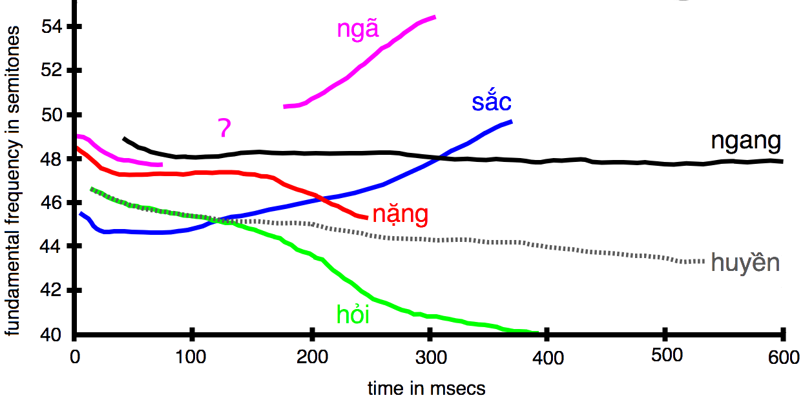
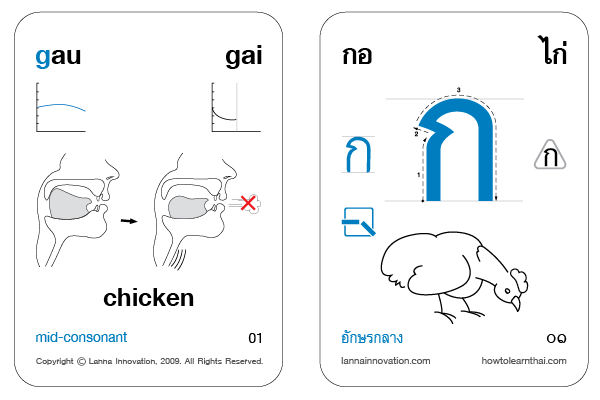

# Tonal

Tonal is a frequency contour visualization tool for foreign language acquisition. By providing visual insight into tones (relative pitch and duration), foreign language learners can improve their hearing and speaking skills faster and more accurately. This is especially useful for tonal languages (languages in which [tones are phonemic](https://en.wikipedia.org/wiki/Tone_%28linguistics%29)), but also for those languages that use tone for semantic differences, such as English.

Example of Vietnamese frequency contour display:

Image from [Wikipedia](https://commons.wikimedia.org/wiki/File:VietnameseToneHanoi.png).

## Tones

> Tone is the use of pitch in language to distinguish lexical or grammatical meaning – that is, to distinguish or to inflect words. -Yip, Moira (2002). Tone. Cambridge University Press. pp. 1–3, 12–14.

Tone is also called pitch or frequency. Tones exist on two dimensions, the relative frequency and the relative duration. That is, the fundamental unit of differentiation (phonemic boundary) is not only of sound, but of tone, and of time.

In the Thai language there are effectively 10 tones, five short and five long (though not all sounds can be meaningfully expressed in all ten tones). Most of the dimensions for sound and tone is expressed in Thai (though there are still some ambiguities which must be known outside of writing), but for the Thai language learner, especially coming from a non-tonal language, tones are difficult to hear, remember, and reproduce, and tone rules are complex.

## Visual Feedforward and Feedback

Training the ear and the mouth to recognize and reproduce sounds and tones correctly can be assisted with visual aids.

For example, Lanna Innovation has produced Thai language learning cards with Sammy Diagrams as well as tone frequency contours:

Image from [howtolearnthai.com](http://howtolearnthai.com/) used with permission.

## Terms

- Pitch, tone, frequency, fundamental frequency, f0, perceived pitch
    - Visualized as height on a y-axis plotted at actual frequency
- Stress, amplitude, volume
    - Visualized as color or thickness of a line
- Duration, time
    - Visualized as distance on an x-axis

## Related Issues

The English language alternates between stressed and unstressed syllables. This is done by amplitude (volume). In addition, tone is used generally for semantics, such as questioning and emphasis. If both of these dimensions (amplitude modulation and frequency modulation) could be mapped visually, this could be fed into synthetic speech to make generated language more naturalistic and meaningful.

Stressed-timed language (such as English) means that the rhythm of the language needs to be learned.<http://www2.nkfust.edu.tw/~emchen/Pron/papers/paper-2.html>
